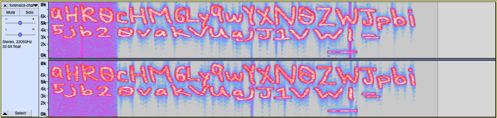
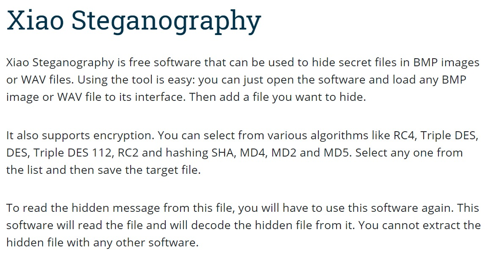

# Voices in the Head

### Description
**_We found a voice recording in one of the forensic images but we have no clue what's the voice recording about. Are you able to help?_**

### Solution

The provided file is a 5-second audio recording. There is no identifiable speech or musical elements to the file.

Running the file through an audio spectrum analyzer, we can get the following frequency response for the file:



The frequency response reveals the following string:

**aHR0cHM6Ly9wYXN0ZWJpbi**
**5jb20vakVUajJ1VWI=**

The distribution of characters seems to hint at a base-64 encryption. As expected, decoding the string in base-64 gives the following URL:

[***https://pastebin.com/jETj2uUb***](https://pastebin.com/jETj2uUb)

The pastebin link gives another string of special characters:

**++++++++++[>+>+++>+++++++>++++++++++<<<<-]>>>>++++++++++++++++.------------.+.++++++++++.----------.++++++++++.-----.+.+++++..------------.---.+.++++++.-----------.++++++.**

There is an esoteric programming language known as **Brainfuck** which uses the eight commands "+", "-", "<", ">", "[", "]", "." and ",". Using online **Brainfuck** interpreters to decode the given string, we finally arrive at the *exciting* sequence of ASCII characters:

**thisisnottheflag**

This was likely set up by the organisers of the CTF to be a wild goose chase, so our team had to take a step back and analyse the situation to see where the true flag might be hidden.

We tried to run the audio file through other high definition spectrogram generators to investigate the horizontal blip at the bottom of the original image, but it was to no avail.

It was easy to get strongly attached to the spectrogram, as it seemed that audio files had most of their information stored in the frequency response.

On the last day of the competition, the organisers offered a free hint to this problem:

_**Xiao wants to help. Will you let him help you?**_

As CTF's generally like to use obscure software to hide flags, we immediately checked online for any audio-related software named or related to "Xiao".

As we had hoped, we quickly found the following page [https://resources.infosecinstitute.com/topic/steganography-and-tools-to-perform-steganography/](https://resources.infosecinstitute.com/topic/steganography-and-tools-to-perform-steganography/) which informed us about Xiao Steganography.



Installing *Xiao Steganography*, we used it to decrypt the given audio file. The decryption revealed a ZIP file hidden in the audio file, but it required a password to be completely decrypted. Turns out, the wild goose chase from earlier was not for naught. Using **thisisnottheflag** from the earlier part of the challenge, we extracted the ZIP file from the audio.

In the ZIP file contained a Microsoft Word document **This is it.docx**. However, the ZIP file was locked, and none of the previously found strings were able to unlock it.

To see if there was any additional information hidden in the file to allow us to unlock it, we stringed the zip file ```strings theflag.zip```, which gave us a fake flag **govtech-csg{Th1sisn0ty3tthefl@g}**.


Following the logic from before, this could likely be the password to unlock the zip file.

Opening the Word Document with **govtech-csg{Th1sisn0ty3tthefl@g}** gave us the flag for the challenge: **govtech-csg{3uph0n1ou5_@ud10_ch@ll3ng3}** and two hints for Forensic Challenge 3.


