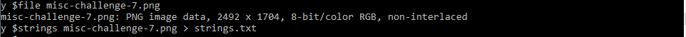
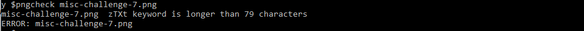
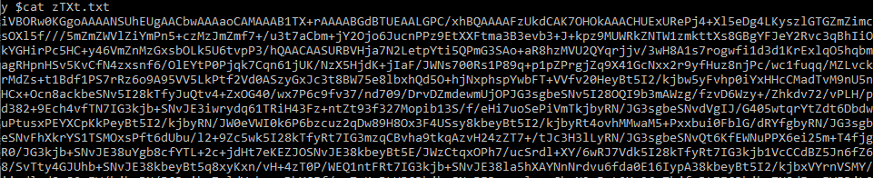
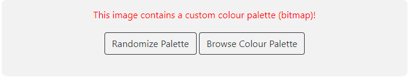

# Where's the flag?

### Description
**_There's plenty of space to hide flags in our spacious office. Let's see if you can find it!_**

### Solution

There is a PNG file provided that shows a photo of the GovTech cafeteria. 

With any Stego challenge, it is usually a good idea to run **file** and **strings** on the target file. 

We don't get anything interesting from the results. Next, we ran **pngcheck** on the file, which checks for the integrity of PNG data chunks.

Hmmm, we get an error saying that the zTXt keyword is longer than the limit. zTXt chunks are generally used for conveying textual information about the image which might contain the flag. We can extract the zTXt chunk through a hex editor or by uploading it to an online extractor like [dcode](https://www.dcode.fr/png-chunks).

The extracted data resembles Base64 encoded data. We upload it to [CyberChef](https://gchq.github.io/CyberChef/#recipe=From_Base64('A-Za-z0-9%2B/%3D',true)) to decode it.

Bingo, the decodes data contains the PNG header. We save it as a PNG file and find that it contains a picture of an actual flag.

After running the usual commands on the new png file, we don't find anything interesting. We uploaded the PNG file to [StegOnline](https://stegonline.georgeom.net/), a useful online stego tool for images. The tool finds a custom bitmap that the image used. A bitmap is something like a colour palette that the pictures uses. The same RGB values can be used for different "colours" on the bitmap but will show up as exactly the same colour on a screen. 

We can either randomize the bitmap which will show any hidden information or we can browse the bitmap to see where the pixels of each colour is. We ge tthe flag hidden on the flag pole, **govtech-csg{f1agcepti0N}**.

### Reflection
Initially we thought that the PNG file was artifically resized to hide pixels as the description seems to hint that the file dimensions is bigger than actual. However, after uploading to [FotoForensics](https://fotoforensics.com/), we didn't find any hidden pixels. 

After running strings on the inital PNG file, there was a long base 64 encoded string that could be decoded if we discard the header "zTXt". 

Having a set of offline and online tools to use on stego challenges will help in case you miss out anything during the competition.

